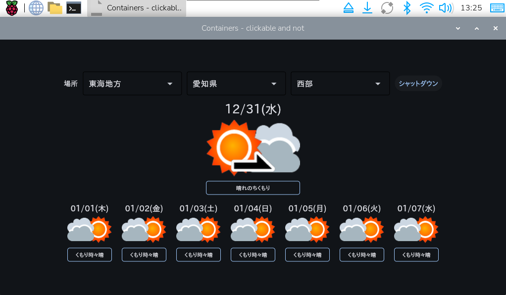

# Weather Signage

raspberry pi 5 用の天気予報表示アプリです。
fletを使用して作成しています。



## setup
### os update
とりあえず、アップデートとアップグレードします。
```
sudo apt update
sudo apt upgrade -y
```
### 日本語フォント インストール
日本語表示のためにフォントをインストールします。
```
sudo apt install fonts-noto-cjk fonts-mplus fonts-ipafont-gothic fonts-ipafont-mincho fonts-vlgothic fonts-takao fonts-morisawa-bizud-gothic fonts-morisawa-bizud-mincho
```
表示に問題がある場合は以下のコマンドで表示されるフォントにソースを書き換えてください。
```
fc-list :lang=ja
```
### シャットダウンコマンド設定
シャットダウンボタンを動作させるためにシャットダウンコマンドをrootパスワード無しで実行できるようにする必要があるかもしれません。

必要なら以下のように設定してください。
```
sudo visudo
# 末尾に追加
[your_username] ALL=(ALL) NOPASSWD: /usr/sbin/shutdown
```

### jma-weather-imagesクローン
天気アイコンと天気コードの翻訳(codes.json)にciscorn様のjma-weather-imagesを利用させてもらっています。
フォルダにをクローンしてください。
```
cd weather-signage
clone https://github.com/ciscorn/jma-weather-images.git
```

### フォルダの初期化
requirements.txtを使用してインストールしてください。
fletは最新(0.80)を使用すると動きません。0.28.3を使用してください。
```
python -m venv .venv
source .venv/bin/activate
pip install -r requirements.txt
```

## Run flet
pythonで実行する場合は以下のコマンドを実行します。
```
flet run
```

## Build the app
fletの正規の方法ではエラーになるので（おそらく、venvかroot権限の問題）、pyinstallerを使用します。
パッケージ化したファイルはdistフォルダに作成されます。
```
pyinstaller src/main.py --noconsole --onefile
```

## Run the app
アイコンやcodes.jsonを相対パスで参照しているので、weather-signageフォルダから実行してください。
```
dist/main
```

